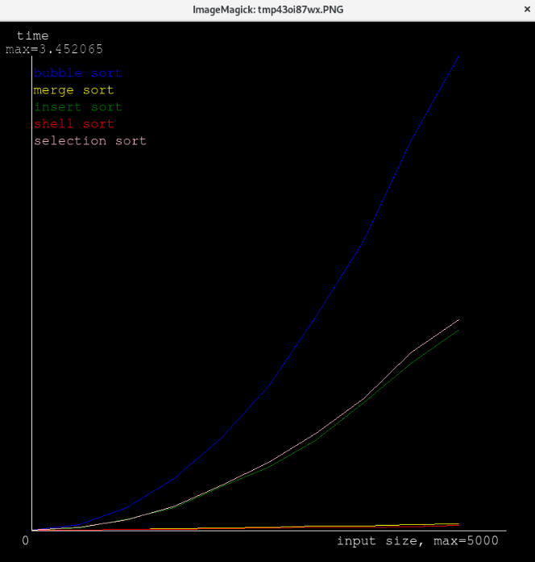

# Complexity graph creator
Prototype of my utility for creating graph from algorithm.

## How to use
Make your own functions like in code. You should understand  
You need Python3 and Pillow library.  
`pip install Pillow`

## Screenshot

### Info
Code is chaotic cause i was lazy to make it pretty.
Next version comming soon?
